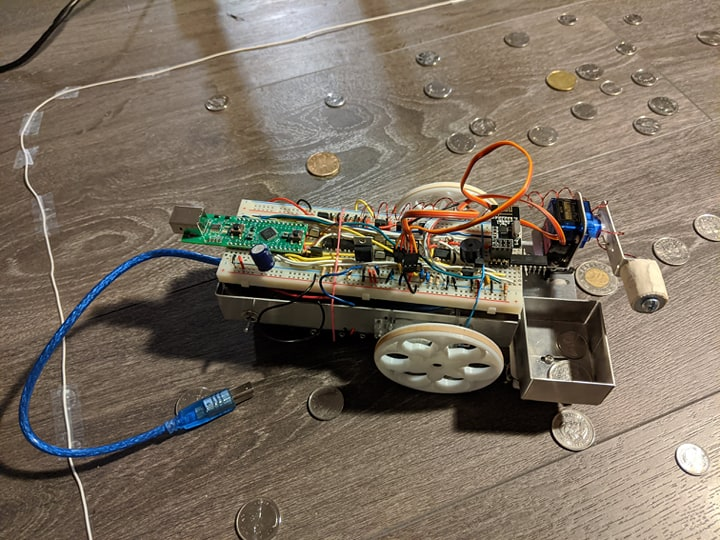
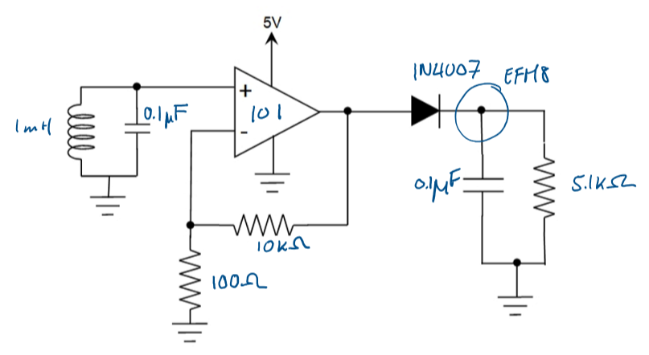

University of British Columbia  
ELEC 291

Team B8  
- Bryan Nsoh
- Will Chaba
- Isabelle Andre
- Debby Lin
- Eric Wu
- Daniel Nadeem

*1st Place Winners of the UBC ELEC 291 Coin Picking Robot Competition 2020*

# Project 2 Coin Picking Robot

A battery operated coin picking robot functioning automatically and manually with a remote control.

## Project Details

This project consisted in designing a battery operated coin picking robot. The robot was
programmed to function with an automatic mode and a manual mode to cover a 0.5 meter squared
area enclosed by a perimeter wire. The robot must be able to detect and pick up all the current
Canadian coins in circulation (0.05$, 0.1$, 0.25$, 1.00$, and 2.00$) when scattered in a random
arrangement before the coin picking process begins.

*Completed Coin Picking Robot*

## Technical Components

### Microcontrollers

Two microcontrollers were used in this project. An EFM8 was used for the main robot's coin picking
function, and an STM32F051 was used for the remote control. The main board mounted on the robot
was powered using four AA batteries connected to a switch on the outside of the cart to operate
the robot's wheels and power the electromagnet. The robot's arm was first powered by the EFM8 for testing purposes before
being exchanged for a 9V battery to power the servo arm movements.

### Metal Detector

Coins were detected using a metal detector assembled from a 1mH inductor from a Colpitts oscillator.
The inductor is driven by a constant current to create a magnetic field, inducing an emf voltage
causing detectable increases in frequency of the current through the inductor as the robot moves
over a coin. Once the coin is detected, the robot stops and sends a signal to the servos controlling
the arm, and picks up the coin using an electromagnet.

### Electromagnet

Whe picking up a coin, the electromagnet is turned on and off using an N-mosfet switch controlled
by the EFM8 microcontroller.

### Perimeter Wire and Function Generator

The coin picking robot's area of operation was restricted to be within a 0.5 squared meter area
enclosed by a perimeter wire. Due to teh absence of lab equipment such as a function generator,
an AC source delivered by a 9V battery powered LM555 acting as an oscillator to generate a square
wave passing through the perimeter wire and inducing detectable flux changes near the wire.

*Function Generated (CH1) and Peak Detector Output (CH2)*

### Peak Detector

This component was perhaps the most complex part of this project, as it required extensive knowledge
of other course material such as circuit analysis and electromagnetism. To detect the perimeter's
induced emf, two tank circuits consisting of a 0.1 uF capacitor and a 1mH Colpitts oscillator
inductor were attached to the bottom of the robot that leads into a simple peak detector and amplifier
circuit.

*Peak Detection Circuit*

As the tank's resonnant frequency was calculated to be 16 kHz, the function generator
needed to be tuned accordingly to deliver a 16 kHz square wave. This was accomplished using two
2 kOhm resistors connected to the LM555 timer. The presence of two tank circuit ensured the coverage
of all angles of approach to the perimeter wire, as the tank circuit would only resonate with the
perimeter wire's 16 kHz square wave when perpendicular to it. The magnetic field lines of the inductor
must be parallel to the magnetic field lines of the perimeter's straight wire. This can be confirmed
using the Right Hand Rule for magnetic fields of a straight wire and a solenoid.

### Remote Controller and Transreceiver

The transmitter is controlled using the STM32 microcontroller with a BO230XS USB serial interface
to connect to a computer for power. An NRF24 Transreceiver is used to communicate with the EFM8
microcontroller controlling the main robot's movements. To collect user inputs, a modified Xbox 360
controller is used and connected to the circuit board. New pushbuttons were mounted underneath the ABXY
buttons on the controller. The controller's analog stick is used for directional control. User inputs
are sent wirelessly to the EFM8 microcontroller by reading the ADC (analog to digital converter) to find
the analog stick's position. The voltage read is translated to a number between 1 and 9 in which the
desired direction for the robot is the number's position on a dialpad as shown below.

	Analog stick directions:
	[7]	[8]	[9]
	[4]	[5]	[6]	
	[1]	[2]	[3]
	This is based of a standard dial pad, with the analog stick centered at 5

This signal is then sent using the NRF24 wireless transceiver to the EFM8, which upon successful receival
of the transmission, returns a verification that the message.

### Extra Special Features

- Added Mario music effects sharing the functions of Timer 2 with the wheels
- Implemented the use of a mapped analog stick and buttons from an Xbox controller rather than a Nunchuk stick as described in the project files

## Youtube Link Online Demo 

ELEC 291 Project 2 Team B8 Online Demo

https://youtu.be/4grgkY-fsU0

*Team B8 was the only team to undertake the challenge of completing the entire project, with
minimal social interaction.*

### Extra: Project Casualties
- 4 Burnt mosfets
- 3 Internally broken wires
- 1 Broken breadboard
- 2 Servo motors
- 3 Dead 9V batteries
- 8 Dead AA batteries
